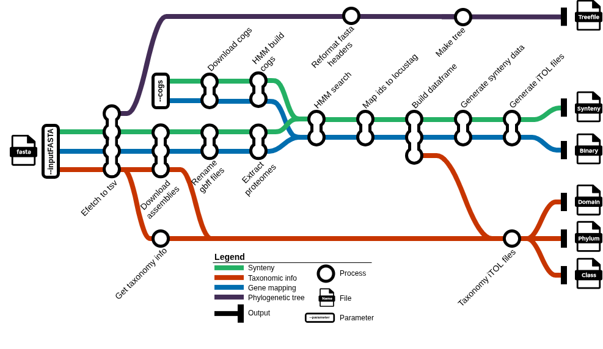

# SynteniToL

[](https://opensource.org/licenses/MIT)
[](https://hub.docker.com/r/manulonigro/syntenitol)

A Nextflow DSL 2 pipeline for synteny analysis of protein sequences against genomic annotations, using HMMER for domain detection and generating visualizations for [iTOL](https://itol.embl.de/) (Interactive Tree of Life).

---

## Table of Contents

- [About](#about)
- [Installation](#installation)
- [Quick Start](#quick-start)
- [Usage](#usage)
- [Pipeline Overview](#pipeline-overview)
- [License](#license)
- [Contact](#contact)

---

## About

SynteniToL enables researchers to perform comparative micro-synteny analysis across multiple prokaryotic genomes by detecting homologous proteins (using COG profiles) and generating publication-ready visualizations for iTOL.



**Key features:**

- Automated retrieval of genome annotations from NCBI
- HMMER-based domain detection using COG (Clusters of Orthologous Groups) profiles
- Synteny context extraction and visualization
- iTOL-compatible output files for interactive phylogenetic trees and synteny plots
- Taxonomy-aware visualizations
- Fully containerized with Docker for reproducible execution

This pipeline is particularly useful for microbiologists studying gene cluster evolution, horizontal gene transfer, and genomic rearrangements across related species.

---

## Installation

### Prerequisites

- [Nextflow](https://www.nextflow.io/) (version 21.0 or higher)
- [Docker](https://www.docker.com/)

---

## Quick Start

**Input FASTA file:**

The input FASTA file should contain protein sequences. Each sequence header should include an accession number that can be resolved by NCBI (e.g., from BLASTp results):

```fasta file
>WP_145111153.1:6-544 formylmethanofuran...
MVLSPADKTNVKAAVKGEG...
>WP_200486823.1:5-533 formylmethanofuran...
MLSGIV...
```

**Run the pipeline** with minimal required parameters:

```bash
nextflow run main.nf \
    --inputFASTA input_proteins.faa \
    --cogs COG1152,COG1795 \
```

**Output:**

```
results/run_timestamp/
├── class.itol.txt              # iTOL taxonomic info file: Classes
├── phylum.itol.txt             # iTOL taxonomic info file: Phylums
├── domain.itol.txt             # iTOL taxonomic info file: Domains
├── tree_timestamp.nwk          # Phylogenetic tree
├── itol_binary.txt             # iTOL dataset: Mapped genes
├── itol_synteny_oriented.txt   # iTOL dataset: Synteny
├── formatted_headers.fasta     # header format: protein_id|specie_name|strain|isolate
├── run_command.txt             # Reproducibility record
├── timeline.html               # Nextflow execution timeline
├── report.html                 # Nextflow execution report
├── trace.txt                   # Nextflow task trace
└── flowchart.png               # Nextflow workflow DAG
```

---

## Usage

```
Do a blastp in NCBI (https://blast.ncbi.nlm.nih.gov/Blast.cgi?PROGRAM=blastp&PAGE_TYPE=BlastSearch&LINK_LOC=blasthome)
Get the COG id of the query protein

Go to your terminal, move to SynteniToL dir:
nextflow run main.nf [OPTIONS]
```

### Required Parameters

| Parameter          | Description                                                               |
|--------------------|---------------------------------------------------------------------------|
| `--inputFASTA`     | Input FASTA file containing protein sequences (e.g., from BLASTp results) |
| `--cogs`           | Comma-separated list of COG identifiers (e.g., `COG1152,COG1795`). Each COG must appear only once. |
**IMPORTANT: the first cog in --cogs is the COG of the protein homologs in the FASTA file**

### Optional Parameters

| Parameter               | Description                                                                                    |
|-------------------------|------------------------------------------------------------------------------------------------|
| `--custom_hmm_profiles` | Comma-separated paths to custom HMM profiles (e.g., `profile_x.hmm,profile_y.hmm`). Each path must appear only once, and each resolved profile name must be unique (names are taken from the filename, without `.hmm` and an optional `profile_` prefix). |
| `--query_profile`       | Profile label used as reference for synteny plots instead of the first COG (must match a COG or custom profile name) |
| `--color_by_group`      | Group COGs for coloring in iTOL (format: `COG1229-COG1029,COG2218`)                             |
| `--no_taxonomy`         | Skip NCBI taxonomy lookup and taxonomic iTOL layers (domain/phylum/class)                      |
| `--outdir`              | Output directory for results                                                                   |
| `--help`                | Display help message                                                                           |

### NCBI API key (optional)

To increase NCBI rate limits, provide your NCBI API key **without passing it on the command line** (doing so would leak it into the execution report, `run_command.txt`, the Nextflow logs and the process scripts). Instead, use one of the two supported methods:

```bash
# Option 1 (recommended): store it as a Nextflow secret
nextflow secrets set NCBI_API_KEY "your_ncbi_api_key"

# Option 2: export it in your shell before launching
export NCBI_API_KEY="your_ncbi_api_key"
```

If no key is provided the pipeline still works, just with public NCBI rate limits (a slower sleep is used between taxonomy queries).

### Input validation

Before any process runs, the pipeline checks `--cogs` and `--custom_hmm_profiles` for duplicates. If a value is repeated, the run stops immediately with an error that lists the duplicates (including how many times each appears).

- **`--cogs`**: duplicate COG IDs are rejected (e.g. `COG1152,COG1795,COG1152`).
- **`--custom_hmm_profiles`**: duplicate file paths are rejected; duplicate profile names resolved from different paths are also rejected (e.g. `dir1/gene1.hmm` and `dir2/gene1.hmm` both map to profile name `gene1`).

COG identifiers must also match the format `COGXXXX` with `XXXX` from `0001` to `5950`; invalid IDs are rejected at startup.

### Examples

**Basic usage:**

```bash
export NCBI_API_KEY="your_ncbi_api_key"   # optional: set via `nextflow secrets set NCBI_API_KEY "..."` instead
nextflow run main.nf \
    -profile docker \
    --inputFASTA proteins.faa \
    --cogs COG1152,COG1795,COG2218
```

**With group coloring (COG1229 and COG1029 share the same color):**

```bash
nextflow run main.nf \
    -profile docker \
    --inputFASTA proteins.faa \
    --cogs COG1152,COG1229,COG1029,COG2218 \
    --color_by_group "COG1229-COG1029,COG2218,COG1152"
```

### Getting an NCBI API Key

1. Sign in to your [NCBI account](https://www.ncbi.nlm.nih.gov/account/)
2. Go to [API Keys Settings](https://www.ncbi.nlm.nih.gov/account/settings/)
3. Generate a new API key

> **Note:** Without an API key, NCBI limits requests to 3 per second. With an API key, the limit increases to 10 per second.

---

## Pipeline Overview

```
┌─────────────┐
│  Input      │
│  FASTA      │
└──────┬──────┘
       │
           ▼
┌─────────────────────────────────────────────────────────────────┐
│  1. Fetch genome metadata from NCBI (efetch_to_tsv)             │
└─────────────────────────────────────────────────────────────────┘
       │
           ▼
┌─────────────────────────────────────────────────────────────────┐
│  2. Download genome annotations from NCBI Assembly Database     │
│     - Split into batches of 50 for efficient downloading        │
│     - Handle missing assemblies gracefully                      │
└─────────────────────────────────────────────────────────────────┘
       │
           ▼
┌─────────────────────────────────────────────────────────────────┐
│  3. Download COG profiles from NCBI                             │
└─────────────────────────────────────────────────────────────────┘
       │
           ▼
┌─────────────────────────────────────────────────────────────────┐
│  4. Build HMM profiles from COG multiple sequence alignments    │
└─────────────────────────────────────────────────────────────────┘
       │
           ▼
┌─────────────────────────────────────────────────────────────────┐
│  5. HMMER search against proteomes                              │
│     - Scan all genomes for COG domain presence                  │
│     - Extract locus tags and protein mappings                   │
└─────────────────────────────────────────────────────────────────┘
       │
           ▼
┌─────────────────────────────────────────────────────────────────┐
│  6. Build results dataframe and extract synteny contexts        │
│     - First COG in list = reference for synteny plots           │
│     - Calculate gene neighborhoods and conservation             │
└─────────────────────────────────────────────────────────────────┘
       │
           ▼
┌─────────────────────────────────────────────────────────────────┐
│  7. Generate iTOL visualization files                           │
│     - Synteny plots, presence/absence matrices, taxonomy trees  │
└─────────────────────────────────────────────────────────────────┘
```

**Pipeline steps in detail:**

1. **NCBI Data Fetching**: Parses input FASTA and retrieves genome metadata from NCBI using E-utilities
2. **Genome Download**: Downloads genome annotations (GBFF) from NCBI Assembly Database
3. **COG Profile Download**: Fetches COG multiple sequence alignments from NCBI
4. **HMM Profile Building**: Builds HMM profiles from COG alignments using `hmmbuild`
5. **Domain Detection**: Scans all proteomes with HMMER using `hmmsearch`
6. **Gene Mapping**: Maps protein IDs to locus tags and gene positions
7. **Synteny Analysis**: Extracts syntenic contexts around the first COG of --cogs
8. **Visualization**: Generates iTOL-compatible files for interactive visualization

---

## License

This project is licensed under the MIT License - see the [LICENSE](LICENSE) file for details.

---

## Contact

**Author:** ManuLONIGRO
**Email:** lonigromanuel@gmail.com

For questions, issues, or feature requests, please open an issue on the project repository.

